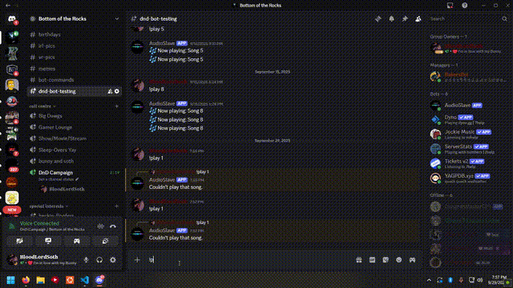

# AudioSlave

<br>

### DEMO
**[https://audioslave-l9ch.onrender.com/](https://audioslave-l9ch.onrender.com/)**




## Description
```
AudioSlave allows a user to upload their music to the Database, play their music in the web browser, or share their uploaded music over a Discord VC with the AudioSlavebot
```

**[github.com/BloodLordSoth/AudioSlaveBot](http://github.com/BloodLordSoth/AudioSlaveBot)**

<br>


## Tech
```
- Frontend HTML/CSS/Javascript
- Backend Node.js/Express
- Dependencies express dotenv jsonwebtoken better-sqlite3 cors bcrypt multer
``` 

---
### BloodLordSoth
[GitHub](http://github.com/BloodLordSoth) | [Youtube](http://youtube.com/@BloodLordSoth)